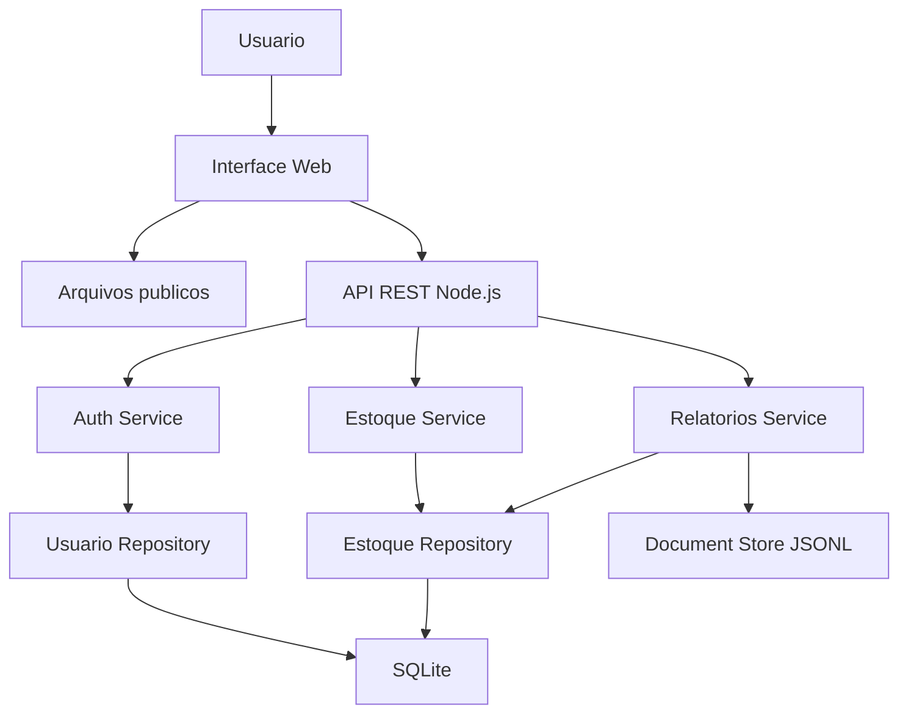
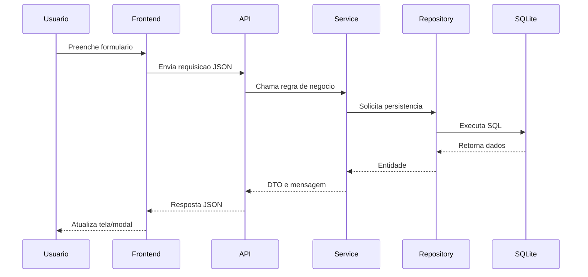

# Arquitetura do Sistema

## Visao geral

## Banco transacional

O SQLite guarda os dados operacionais:

- usuarios;
- sessoes;
- fornecedores;
- produtos;
- associacoes produto/fornecedor;
- atividades.

## Camada documental NoSQL

A camada JSONL guarda snapshots analiticos dos relatorios:

- indicadores;
- dimensoes;
- alertas de baixo estoque;
- historico de visoes gerenciais.

Essa separacao demonstra o uso combinado de dados transacionais e documentos analiticos.

## Fluxo principal

## Decisoes arquiteturais

- API REST simples para facilitar demonstracao.
- SQLite por ser leve e sem instalacao externa.
- JSONL como NoSQL local para documentos analiticos.
- DTOs para separar modelo interno do contrato da API.
- Services para manter regras de negocio testaveis.
- Modais no frontend para reduzir poluicao visual.
