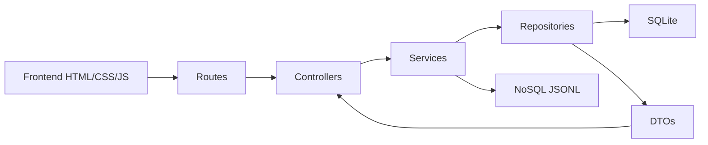

# Modular Review

## Objetivo

Avaliar se o projeto esta organizado em modulos reutilizaveis e de facil manutencao.

## Arquitetura atual

## Camadas

| Camada | Responsabilidade | Arquivos |
| --- | --- | --- |
| Config | Centralizar caminhos e porta | `src/config/app.config.js` |
| Routes | Direcionar requisicoes | `src/routes/*.js` |
| Controllers | Adaptar HTTP para services | `src/controllers/*.js` |
| Services | Concentrar regras de negocio | `src/services/*.js` |
| Repositories | Executar consultas SQL | `src/repositories/*.js` |
| DTOs | Padronizar saida da API | `src/dtos/*.js` |
| Validators | Validar dados de entrada | `src/validators/*.js` |
| Database | Conexao e schema | `src/database/*.js` |
| NoSQL | Snapshots documentais | `src/nosql/document-store.js` |

## Conclusao

A modularizacao atende ao objetivo de facilitar manutencao, teste e evolucao. O projeto deixou de depender de um unico arquivo de servidor e passou a ter uma arquitetura em camadas.

## Melhorias futuras

- Separar o frontend em modulos ES ou React.
- Adicionar testes unitarios por service.
- Criar documentacao OpenAPI para a API.
- Trocar a camada JSONL por MongoDB se o requisito academico exigir uma ferramenta NoSQL real.
